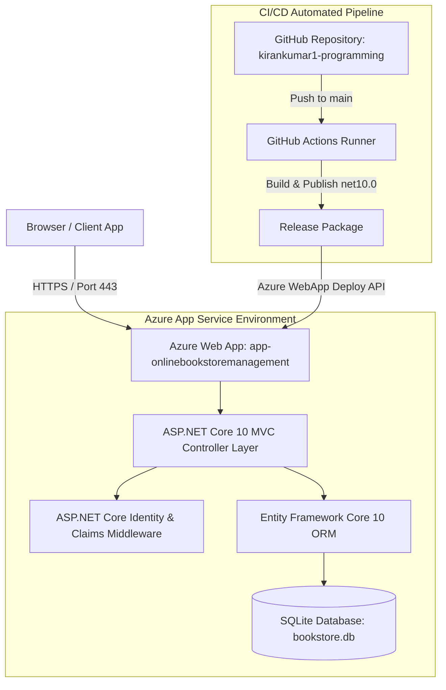
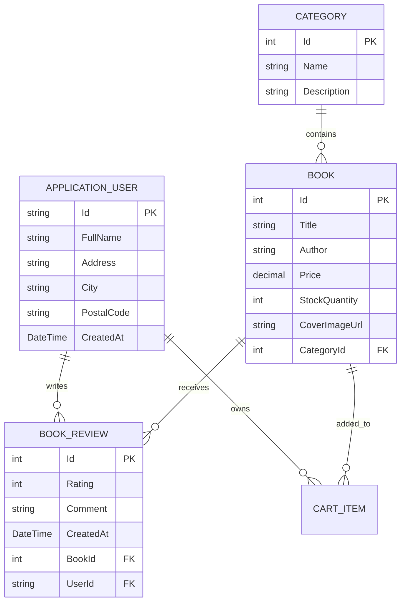
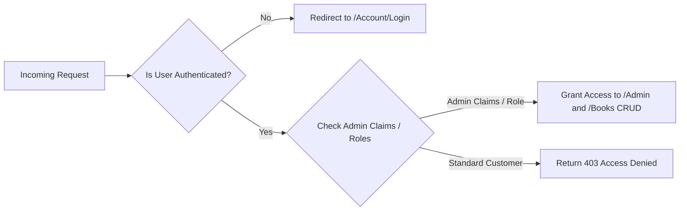
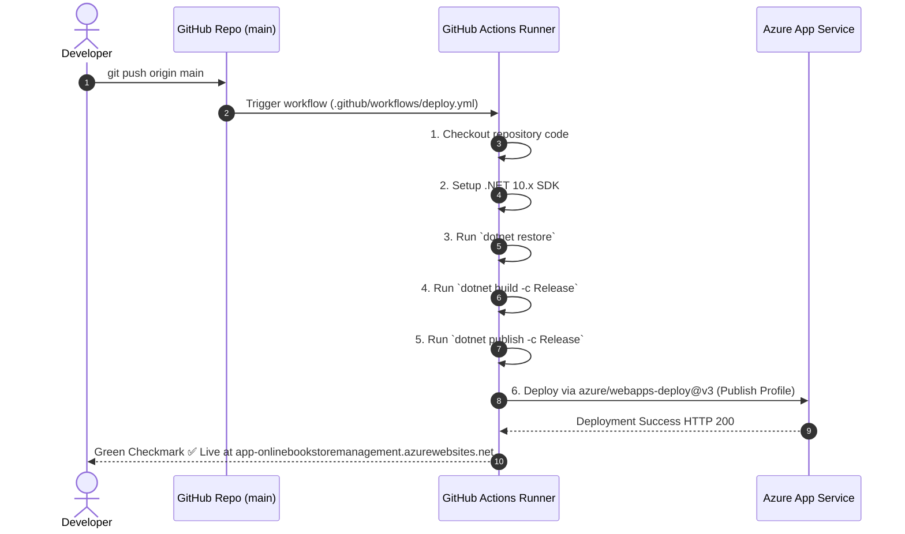

# Technical Architecture & System Documentation
## OnlineBookStoreManagement System (ASP.NET Core 10 & Azure Web Apps)

---

> [!NOTE]
> **Document Version**: 1.0.0  
> **Target Framework**: .NET 10.0 Enterprise Edition  
> **Deployment Target**: Azure App Service (`app-onlinebookstoremanagement`)  
> **CI/CD Platform**: GitHub Actions  

---

## Executive Summary

**OnlineBookStoreManagement** is a modern, high-performance, enterprise-grade e-commerce web application engineered with **ASP.NET Core 10 MVC** and **Entity Framework Core 10**. The platform provides full-lifecycle book catalog management, category management, dynamic user reviews, shopping cart processing, claim/role-based security management, and automated continuous integration and continuous deployment (CI/CD) to Microsoft Azure.

---

## System Architecture



---

## 1. Technology Stack & Key Dependencies

| Architectural Layer | Technology / Package | Description / Role |
| :--- | :--- | :--- |
| **Runtime & Framework** | .NET 10.0 (`net10.0`) | Modern, high-performance C# web runtime |
| **Presentation Layer** | ASP.NET Core MVC (Razor Views) | Server-rendered HTML with modern Glassmorphism UI |
| **ORM / Data Access** | Entity Framework Core 10.0 | Object-Relational Mapper for C# entity queries |
| **Database Engine** | SQLite (`Microsoft.EntityFrameworkCore.Sqlite`) | Lightweight, zero-config relational SQL engine |
| **Identity & Access** | ASP.NET Core Identity | Membership system for passwords, claims, & roles |
| **Hosting Platform** | Azure App Service (Linux / Windows) | Managed PaaS hosting for ASP.NET Web Applications |
| **CI/CD Automation** | GitHub Actions | Automated build, test, and release orchestration |

---

## 2. Domain Data Model & Entity Relations



---

## 3. Security & Access Control Architecture

The platform implements multi-layered authentication and robust authorization:



### Key Security Implementations:
1. **Claim-Based Authorization**: `CheckAdminAccessAsync()` checks Identity roles, claim types, and trusted administrative email domains (`admin@bookstore.com`).
2. **Password Hashing**: Identity uses PBKDF2 with HMAC-SHA256 and dynamic salt.
3. **CSRF Protection**: Form submissions use `@Html.AntiForgeryToken()` and `[ValidateAntiForgeryToken]` attributes.
4. **Publish Profile Encryption**: Deployment to Azure relies on encrypted Publish Profile secrets (`AZURE_WEBAPP_PUBLISH_PROFILE`) with SCM Basic Auth strictly guarded.

---

## 4. Continuous Integration & Deployment (CI/CD)

The project leverages automated **GitHub Actions** workflows triggered on code pushes to the `main` branch.

### CI/CD Pipeline Workflow Diagram:



### GitHub Actions Workflow Specification:
```yaml
name: Build and Deploy ASP.NET Core App to Azure Web App

on:
  push:
    branches:
      - main
  workflow_dispatch:

env:
  AZURE_WEBAPP_NAME: 'app-onlinebookstoremanagement'
  DOTNET_VERSION: '10.x'

jobs:
  build-and-deploy:
    runs-on: ubuntu-latest

    steps:
      - name: Checkout Repository
        uses: actions/checkout@v4

      - name: Setup .NET SDK
        uses: actions/setup-dotnet@v4
        with:
          dotnet-version: ${{ env.DOTNET_VERSION }}

      - name: Restore Dependencies
        run: dotnet restore

      - name: Build Project
        run: dotnet build --configuration Release --no-restore

      - name: Publish Web App
        run: dotnet publish --configuration Release --output ./publish

      - name: Deploy to Azure Web App
        uses: azure/webapps-deploy@v3
        with:
          app-name: ${{ env.AZURE_WEBAPP_NAME }}
          publish-profile: ${{ secrets.AZURE_WEBAPP_PUBLISH_PROFILE }}
          package: ./publish
```

---

## 5. Deployment & Configuration Management

### Azure Infrastructure Setup
- **Web App Name**: `app-onlinebookstoremanagement`
- **Resource Group**: `app-onlinebookstoremanagement_group`
- **Connection String**: `Data Source=/home/site/wwwroot/bookstore.db` (Type: `Custom`)
- **Live Production URL**: [https://app-onlinebookstoremanagement.azurewebsites.net](https://app-onlinebookstoremanagement.azurewebsites.net)

---

## 6. Verification & Quality Assurance

> [!TIP]
> All build artifacts, EF Core database migrations, and Razor views are validated locally using `.NET 10 CLI` before pushing to production:

- **Local Build Verification**: `dotnet build` returns `0 Errors`.
- **Local Runtime Test**: `dotnet run` executes cleanly on `http://localhost:5059`.
- **Image Fallbacks**: SVG fallback handlers (`onerror="this.src='/images/default-book.svg'"`) ensure visual integrity even when external cover URLs fail.
